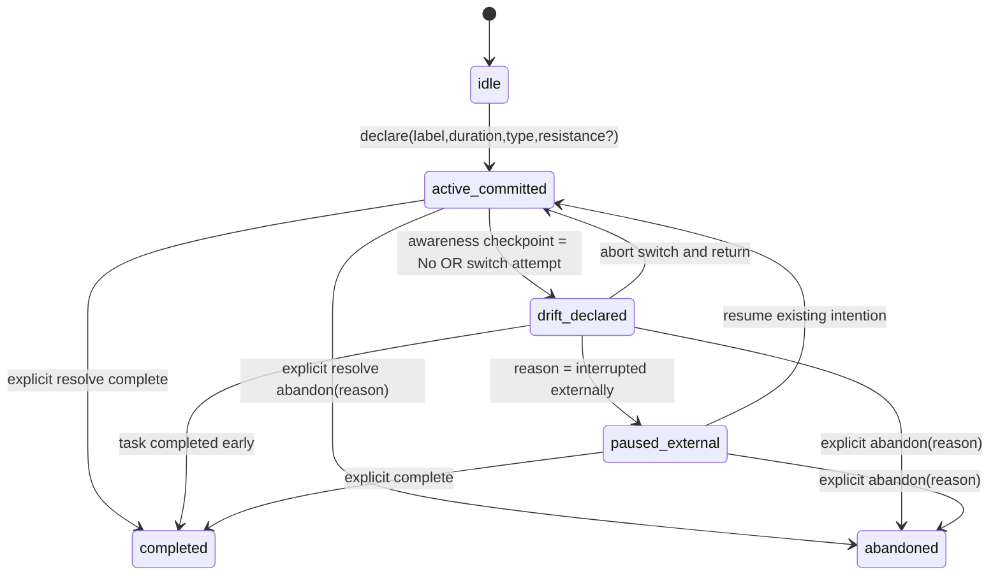

# Behavioral Discipline Engine Redesign (Implementation Plan)

## 1) State machine (Declare → Commit → Defend → Resolve)

### Transition invariants
- Exactly one `active_committed` session allowed globally.
- `drift_declared` can only be entered from `active_committed` via switch protocol.
- `abandoned` requires explicit free-text reason.
- No silent transition: every transition requires a use case call and persisted event.

## 2) Data model

### `IntentionSession`
- `id`, `label`, `declaredDuration`, `startedAt`
- `type`: `mandatory | growth | maintenance | optional`
- `resistanceLevel` (1-5 optional)
- `state`: `idle | active_committed | drift_declared | paused_external | completed | abandoned`
- `segments[]`: non-overlapping focused intervals
- `deviations[]`: switch/avoidance events
- `interruptions[]`: externally caused pauses
- `completedAt`, `abandonedAt`, `abandonmentReason`
- `defended` (false on voluntary switch/avoidance)
- `awarenessCheckpointResponded` (mandatory 25% acknowledgement)

### `DeviationEvent`
- `timestamp`
- `reasonType`: `interruptedExternally | voluntarySwitch | avoidanceImpulse | taskCompletedEarly`
- `declaredPriority`: `urgent | important | neutral | impulse`
- `replacedBySessionId` (optional)
- `explicitTradeoffDeclaration`

### `Segment`
- `start`, `end`

## 3) Migration plan (`LogEntry` → `IntentionSession`)

1. Group legacy rows by `rootId = parentId ?? id`.
2. Create one `IntentionSession` per root.
3. Convert every grouped row to a `Segment` (`startedAt`/`endedAt`).
4. Convert child/linked rows into `DeviationEvent` records.
5. Convert paused rows into `InterruptionEvent` records.
6. Determine final state from root status (`active/paused/completed/abandoned`).
7. Set `defended=false` if any deviation exists.
8. Run invariants post-migration:
   - no overlapping segments,
   - no multiple active sessions,
   - drift events only when active existed in source timeline.

## 4) Repository interface changes

New repository contract (`IntentionRepository`):
- `loadActive()`
- `loadByDay(day)`
- `upsert(session)` / `upsertAll(sessions)`
- `incrementDailyDeviationCounter(day)`

This replaces fragmentation-oriented methods that create linked session rows.

## 5) Behavioral metric formulas (descriptive, non-gamified)

Let:
- `S` = total sessions in range
- `D` = total deviations in range
- `Defended` = sessions with `defended=true`
- `Completed` = sessions in `completed`
- `CompletedClean` = completed sessions with `deviations=0`

Metrics:
- **Commitment Integrity Score** = `Defended / S`
- **Deviation Frequency** = `D / S`
- **Average Time to First Drift** = mean(`firstDeviation.timestamp - startedAt`) for sessions that drifted
- **Completion Integrity %** = `CompletedClean / Completed`
- **Voluntary Switches** = count(reasonType=`voluntarySwitch`)
- **Impulse Frequency** = count(reasonType=`avoidanceImpulse`)

## 6) Removed / neutralized components

- Points accumulation logic for pause/completion volume.
- Level progression logic.
- Count-based badge unlocks.
- Dashboard rendering of Points/Level/Badges.
- Parent-child chaining as primary behavior model (replaced by segments/deviations on one session entity).

## 7) Risk assessment

### High-risk
- **Persistence migration correctness**: legacy chained rows may contain inconsistent parents.
- **Active-session exclusivity**: race conditions if multiple UI actions dispatch concurrently.
- **State transition hardening**: older controllers may bypass use cases.

### Medium-risk
- **Analytics parity drift**: historical score/streak charts no longer comparable.
- **Notification semantics**: 25% checkpoint introduces mandatory interruptive prompt behavior.

### Mitigations
- Wrap all transitions in `BehaviorEngine` and reject invalid transitions with errors.
- Run one-time migration dry-run and write mismatch report before applying.
- Add invariant/property tests for overlap, active uniqueness, and drift prerequisites.
- Keep compatibility shim for gamification storage reads while no longer rendering those values.
